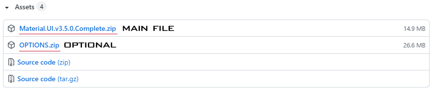
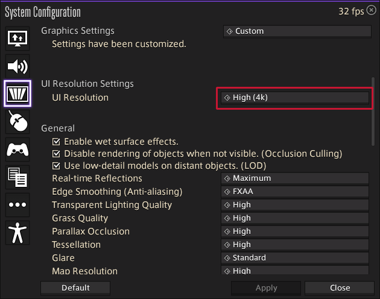
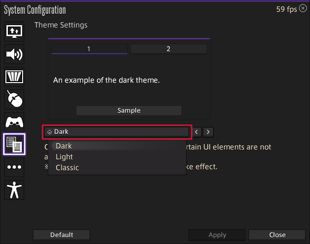

## FFXIV MATERIAL UI
    

## CONTENTS
1. [DISCLAIMERS](#disclaimers)
2. [INTRO](#intro)
3. [PREVIEWS](#previews)
4. [INSTALL GUIDE](#install-guide)
5. [IN-GAME SETTING](#in-game-setting)
6. [OPTIONS](#options)
7. [FAQ](#faq)
8. [SPECIAL THANKS](#special-thanks)
9. [CREDIT AND SUPPORT](#credit-and-support)
10. [CONTACTS](#contacts)

## DISCLAIMERS
>Using third party tools for FFXIV is against the Square Enix User Agreement, and should be done at your own risk as it __could__ result in an account ban. However, Yoshi-P (the game's producer) has said in interviews that while the official stance on third party tools will always be "no", Square Enix both cannot and do not want to see what is installed on your PC. It is a complicated, grey-zone issue that usually ends in circular arguments and it just never ends.
>
>Some tools, like combat trackers, are abused to harass other players while others have a lewd/illegal nature to them, and so Square Enix must be able to ban accounts who use modding for this purpose.
>
>There are a few rules of thumb when it comes to third party tools.
>* Do not harass people.
>* Do not post your character name visibly in modded screenshots.
>* __DO NOT POST MODDED SCREENSHOTS WITH THE SQUARE ENIX COPYRIGHT INFORMATION VISIBLE__.
>
>Square Enix has a much lower tolerance for nsfw mods and will aggressively take down anything that is not "brand safe"
>
>—
>
><i>The first rule of mods, is don't talk about mods.</i>
>
>Yoshi P interview for more context on this matter: https://www.youtube.com/watch?v=e_i6mjiGerU

## INTRO
Material UI replaces FFXIV's built-in theme (dark-theme)

There are two kinds, the concepts for each theme are as follows:

* **Black**: Targeting modern dark color, Edged UI
* **Discord**: Unsupported until further notice. Please refer to [Issue #232](https://github.com/skotlex/ffxiv-material-ui/issues/232) for more information.

## PREVIEWS
#### MAIN MODS (BLACK)

#### OPTIONS

For more information, check out the discord server [here](https://discord.gg/T5sWUpgNPD)

## INSTALL GUIDE
#### YouTube guide
- Thank you `Whiskeyz` for providing this video
  - 📹 https://www.youtube.com/watch?v=zbLWV4Y9HQI

#### If the game is running before following the guide, close it.
1. Download the latest version of the Material UI and OPTIONS from the [Releases page](https://github.com/skotlex/ffxiv-material-ui/releases/latest).

2. Unzip the downloaded compressed files to somewhere you can find them.  
    - If you already have TexTools installed skip to `step 5`
3. Download the latest version of the `Install_TexTools.exe` file from [here](https://github.com/TexTools/FFXIV_TexTools_UI/releases/latest).
4. Install and run the program.
    - If you do not have the latest version of .NET you will not be able to open the program and will get an error. If this happens download the latest version of .NET here  [.NET downloads](https://dotnet.microsoft.com/download/dotnet/5.0/runtime)
    - Try opening the program again.
    - For additional troubleshooting, join their discord [here](https://discord.gg/ffxivtextools).
5. Click `Help` → `Backup Index Files` menu.
    - This will create a backup, so that if you want to revert the changes you can clear all of them by clicking `Help` → `Start Over`.
6. Click `Mods` → `Import Mod Packs`
7. Select `Material 4K-UI BLACK (version).ttmp2` and hit open button.
    - If you want to apply additional OPTIONS, select the OPTIONS ttmp2 in the same way as `step 6 to 7`
    - Any mods containing conflicting textures will be loaded in the order that they were installed meaning installing an option __before__ the main file will not work as expected. It is generally best to install mods one by one instead of all at once
8. All of the textures will now be loaded next time you launch FFXIV.

## IN-GAME SETTING
If mods is not applied when you start the game, you have to change the in-game setting.
#### Set 4K UI resolution
1. Click `ESC key on keyboard` → `System Configuration` → `Graphic Settings` tab → `UI Resolution Settings`
2. Choose the option: `High (4k)`
    - This is an in-game setting that does NOT require a 4k monitor.
    - It should makes the UI assets render at a higher resolution if you do have a 4k monitor.
3. Reset the game.

Click for visual reference

#### Set color scheme
1. Click `ESC key on keyboard` → `System Configuration` → `Theme Settings`
2. Choose the option: `Dark`
3. Reset the game.

Click for visual reference

## OPTIONS
If you download and unzip the OPTIONS.zip file of [INSTALL GUIDE](#install-guide), there is a preview(.png) file in each folder. Look at the image and if there's anything you like, apply it.

## FAQ
Please refer to a separate page that collects questions that people ask often. [FAQ page](FAQ.md)\
**If you're not familiar with TexTool and mods, or if it's your first time, I strongly recommend you read the page.**

## SPECIAL THANKS
I always thank [*rien-doll*](https://github.com/rien-doll/minimal-ui) for inspiring me and for giving me knowledge. Her creativity always stimulates me. Most of all, I would like to thank everyone who uses this UI.

## CREDIT AND SUPPORT
This mod was created by *skotlex* and help of all testers.

If you like my work and want to support it, you can do it [here](https://ko-fi.com/skotlex). Of course, there is no coercion in this sponsorship, and it's just your choice.

## CONTACTS

Please use [my github issue page](https://github.com/skotlex/ffxiv-material-ui/issues) for various suggestions, questions, and requests for material-UI. It's gonna be easy to keep records and easy to manage.

If you have any questions or concerns, I'm willing to talk but please understand the awkwardness of the sentences because I am not an English user.

* Keep in touch with me on:
 * DISCORD: [JOIN our channel](https://discord.gg/T5sWUpgNPD)
 * TWITTER: [@skotlex](https://twitter.com/skotlex)
